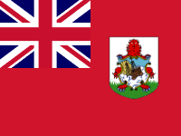
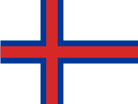
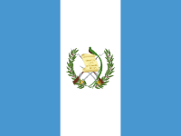
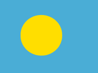
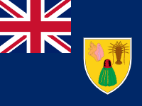
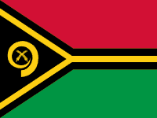
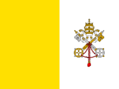

# PyQt Country Picker

[BADGES]

A simply, yet highly customizable country picker widget for PyQt and PySide

[GIF]


## Features
- Supports 235 countries and territories
- Supports only showing certain countries
- Fully customizable country names and flags
- Works with `PyQt5`, `PyQt6`, `PySide2`, and `PySide6`


## Installation
```
pip install pyqtcountrypicker
```


## Usage
Import the `CountryPicker` class and instantiate it like a normal widget:

```python
from PyQt6.QtWidgets import QMainWindow
from pyqtcountrypicker import CountryPicker


class Window(QMainWindow):

    def __init__(self):
        super().__init__(parent=None)
        
        # Init country picker
        self.country_picker = CountryPicker(self)
```


To get and set the currently selected country, you can use the `getCurrentCountry()` and `setCurrentCountry()` methods:
```python
country_picker.setCurrentCountry('us')

selected_country = country_picker.getCurrentCountry()  # 'us'
```


To get notified when the selected country changes, you can subscribe to the `countryChanged` signal:
```python
country_picker.countryChanged.connect(lambda country_code: print('country changed to ' + country_code))
```


## Customization

* **Limiting the countries that can be selected:**
```python
eu_countries = [
    'at', 'be', 'bg', 'hr', 'cy', 'cz', 'dk', 'ee', 'fi',
    'fr', 'de', 'gr', 'hu', 'ie', 'it', 'lt', 'lu', 'lv',
    'mt', 'nl', 'pl', 'pt', 'ro', 'sk', 'si', 'es', 'se'
]

country_picker.setCountries(eu_countries)
```


* **Changing the country names:**
```python
# Setting a single country name
country_picker.setCountryName('af', 'Islamic Emirate of Afghanistan')

# Setting multiple country names at once
new_country_names = {
    'us': 'United States of America',
    'de': 'Federal Republic of Germany',
    'uk': 'England'
}
country_picker.setCountryNames(new_country_names)

# Resetting the country names
country_picker.resetCountryNames()
```


* **Changing the country flags:**

```python
# Setting a single flag
country_picker.setCountryFlag('af', QIcon('af_new_flag.png'))

# Setting multiple flags at once
new_country_flags = {
    'us': QIcon('us_alt.png'),
    'de': QIcon('de_alt.png'),
    'uk': QIcon('uk_alt.png')
}
country_picker.setCountryFlags(new_country_flags)

# Resetting the flags
country_picker.resetCountryFlags()
```


* **Enabling or disabling the country flags:**

```python
country_picker.setCountryFlagsEnabled(False)  # Default: True
```


## Countries

| Country name                   | Country code | Country flag                                                   |
|--------------------------------|--------------|----------------------------------------------------------------|
| Afghanistan                    | af           |     |
| Albania                        | al           |     |
| Algeria                        | dz           |     |
| American Samoa                 | as           |     |
| Andorra                        | ad           |     |
| Angola                         | ao           |     |
| Anguilla                       | ai           |     |
| Antigua and Barbuda            | ag           |     |
| Argentina                      | ar           |     |
| Armenia                        | am           |     |
| Aruba                          | aw           |     |
| Ascension Island               | sh-ac        |  |
| Australia                      | au           |     |
| Austria                        | at           |     |
| Azerbaijan                     | az           |     |
| Bahamas                        | bs           |     |
| Bahrain                        | bh           |     |
| Bangladesh                     | bd           |     |
| Barbados                       | bb           |     |
| Belarus                        | by           |     |
| Belgium                        | be           |     |
| Belize                         | bz           |     |
| Benin                          | bj           |     |
| Bermuda                        | bm           |     |
| Bhutan                         | bt           |     |
| Bolivia                        | bo           |     |
| Bosnia and Herzegovina         | ba           |     |
| Botswana                       | bw           |     |
| Brazil                         | br           |     |
| British Indian Ocean Territory | io           |     |
| British Virgin Islands         | vg           |     |
| Brunei                         | bn           |     |
| Bulgaria                       | bg           |     |
| Burkina Faso                   | bf           |     |
| Burundi                        | bi           |     |
| Cambodia                       | kh           |     |
| Cameroon                       | cm           |     |
| Canada                         | ca           |     |
| Cape Verde                     | cv           |     |
| Caribbean Netherlands          | bq           |     |
| Cayman Islands                 | ky           |     |
| Central African Republic       | cf           |     |
| Chad                           | td           |     |
| Chile                          | cl           |     |
| China                          | cn           |     |
| Colombia                       | co           |     |
| Comoros                        | km           |     |
| Congo - Brazzaville            | cg           |     |
| Congo - Kinshasa               | cd           |     |
| Cook Islands                   | ck           |     |
| Costa Rica                     | cr           |     |
| Côte d'Ivoire                  | ci           |     |
| Croatia                        | hr           |     |
| Cuba                           | cu           |     |
| Curaçao                        | cw           |     |
| Cyprus                         | cy           |     |
| Czechia                        | cz           |     |
| Denmark                        | dk           |     |
| Djibouti                       | dj           |     |
| Dominica                       | dm           |     |
| Dominican Republic             | do           |     |
| Ecuador                        | ec           |     |
| Egypt                          | eg           |     |
| El Salvador                    | sv           |     |
| Equatorial Guinea              | gq           |     |
| Eritrea                        | er           |     |
| Estonia                        | ee           |     |
| Eswatini                       | sz           |     |
| Ethiopia                       | et           |     |
| Falkland Islands               | fk           |     |
| Faroe Islands                  | fo           |     |
| Fiji                           | fj           |     |
| Finland                        | fi           |     |
| France                         | fr           |     |
| French Guiana                  | gf           |     |
| French Polynesia               | pf           |     |
| Gabon                          | ga           |     |
| Gambia                         | gm           |     |
| Georgia                        | ge           |     |
| Germany                        | de           |     |
| Ghana                          | gh           |     |
| Gibraltar                      | gi           |     |
| Greece                         | gr           |     |
| Greenland                      | gl           |     |
| Grenada                        | gd           |     |
| Guadeloupe                     | gp           |     |
| Guam                           | gu           |     |
| Guatemala                      | gt           |     |
| Guinea                         | gn           |     |
| Guinea-Bissau                  | gw           |     |
| Guyana                         | gy           |     |
| Haiti                          | ht           |     |
| Honduras                       | hn           |     |
| Hong Kong                      | hk           |     |
| Hungary                        | hu           |     |
| Iceland                        | is           |     |
| India                          | in           |     |
| Indonesia                      | id           |     |
| Iran                           | ir           |     |
| Iraq                           | iq           |     |
| Ireland                        | ie           |     |
| Israel                         | il           |     |
| Italy                          | it           |     |
| Jamaica                        | jm           |     |
| Japan                          | jp           |     |
| Jordan                         | jo           |     |
| Kazakhstan                     | kz           |     |
| Kenya                          | ke           |     |
| Kiribati                       | ki           |     |
| Kosovo                         | xk           |     |
| Kuwait                         | kw           |     |
| Kyrgyzstan                     | kg           |     |
| Laos                           | la           |     |
| Latvia                         | lv           |     |
| Lebanon                        | lb           |     |
| Lesotho                        | ls           |     |
| Liberia                        | lr           |     |
| Libya                          | ly           |     |
| Liechtenstein                  | li           |     |
| Lithuania                      | lt           |     |
| Luxembourg                     | lu           |     |
| Macao                          | mo           |     |
| Madagascar                     | mg           |     |
| Malawi                         | mw           |     |
| Malaysia                       | my           |     |
| Maldives                       | mv           |     |
| Mali                           | ml           |     |
| Malta                          | mt           |     |
| Marshall Islands               | mh           |     |
| Martinique                     | mq           |     |
| Mauritania                     | mr           |     |
| Mauritius                      | mu           |     |
| Mexico                         | mx           |     |
| Micronesia                     | fm           |     |
| Moldova                        | md           |     |
| Monaco                         | mc           |     |
| Mongolia                       | mn           |     |
| Montenegro                     | me           |     |
| Montserrat                     | ms           |     |
| Morocco                        | ma           |     |
| Mozambique                     | mz           |     |
| Myanmar                        | mm           |     |
| Namibia                        | na           |     |
| Nauru                          | nr           |     |
| Nepal                          | np           |     |
| Netherlands                    | nl           |     |
| New Caledonia                  | nc           |     |
| New Zealand                    | nz           |     |
| Nicaragua                      | ni           |     |
| Niger                          | ne           |     |
| Nigeria                        | ng           |     |
| Niue                           | nu           |     |
| Norfolk Island                 | nf           |     |
| North Korea                    | kp           |     |
| North Macedonia                | mk           |     |
| Northern Mariana Islands       | mp           |     |
| Norway                         | no           |     |
| Oman                           | om           |     |
| Pakistan                       | pk           |     |
| Palau                          | pw           |     |
| Palestine                      | ps           |     |
| Panama                         | pa           |     |
| Papua New Guinea               | pg           |     |
| Paraguay                       | py           |     |
| Peru                           | pe           |     |
| Philippines                    | ph           |     |
| Poland                         | pl           |     |
| Portugal                       | pt           |     |
| Puerto Rico                    | pr           |     |
| Qatar                          | qa           |     |
| Réunion                        | re           |     |
| Romania                        | ro           |     |
| Russia                         | ru           |     |
| Rwanda                         | rw           |     |
| Samoa                          | ws           |     |
| San Marino                     | sm           |     |
| São Tomé & Príncipe            | st           |     |
| Saudi Arabia                   | sa           |     |
| Senegal                        | sn           |     |
| Serbia                         | rs           |     |
| Seychelles                     | sc           |     |
| Sierra Leone                   | sl           |     |
| Singapore                      | sg           |     |
| Sint Maarten                   | sx           |     |
| Slovakia                       | sk           |     |
| Slovenia                       | si           |     |
| Solomon Islands                | sb           |     |
| Somalia                        | so           |     |
| South Africa                   | za           |     |
| South Korea                    | kr           |     |
| South Sudan                    | ss           |     |
| Spain                          | es           |     |
| Sri Lanka                      | lk           |     |
| St. Barthélemy                 | bl           |     |
| St. Helena                     | sh-hl        |  |
| St. Kitts & Nevis              | kn           |     |
| St. Lucia                      | lc           |     |
| St. Martin                     | mf           |     |
| St. Pierre & Miquelon          | pm           |     |
| St. Vincent & Grenadines       | vc           |     |
| Sudan                          | sd           |     |
| Suriname                       | sr           |     |
| Sweden                         | se           |     |
| Switzerland                    | ch           |     |
| Syria                          | sy           |     |
| Taiwan                         | tw           |     |
| Tajikistan                     | tj           |     |
| Tanzania                       | tz           |     |
| Thailand                       | th           |     |
| Timor-Leste                    | tl           |     |
| Togo                           | tg           |     |
| Tokelau                        | tk           |     |
| Tonga                          | to           |     |
| Trinidad & Tobago              | tt           |     |
| Tunisia                        | tn           |     |
| Türkiye                        | tr           |     |
| Turkmenistan                   | tm           |     |
| Turks & Caicos Islands         | tc           |     |
| Tuvalu                         | tv           |     |
| U.S. Virgin Islands            | vi           |     |
| Uganda                         | ug           |     |
| Ukraine                        | ua           |     |
| United Arab Emirates           | ae           |     |
| United Kingdom                 | gb           |     |
| United States                  | us           |     |
| Uruguay                        | uy           |     |
| Uzbekistan                     | uz           |     |
| Vanuatu                        | vu           |     |
| Vatican City                   | va           |     |
| Venezuela                      | ve           |     |
| Vietnam                        | vn           |     |
| Wallis & Futuna                | wf           |     |
| Yemen                          | ye           |     |
| Zambia                         | zm           |     |
| Zimbabwe                       | zw           |     |


## License
This software is licensed under the [MIT license](https://github.com/niklashenning/pyqtcountrypicker/blob/master/LICENSE).
